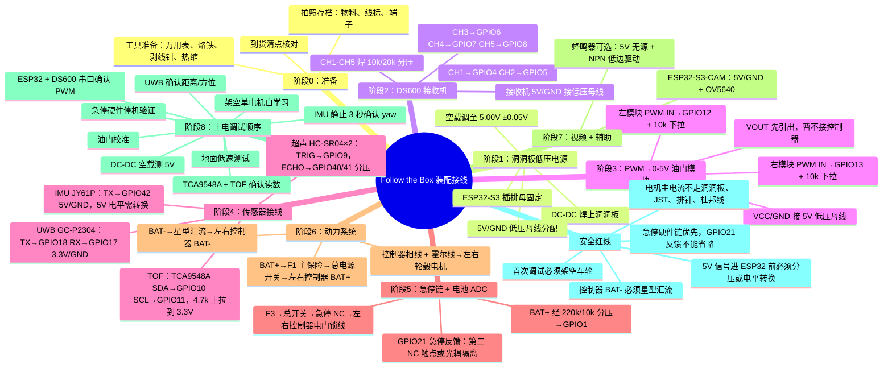

# Follow the Box 装配接线完整流程图

> 适用：首台样机，材料到货日即时可用
> 前置文档：`CURRENT-WIRING-AI.md`、`PIN-MAP-V1.md`、`CURRENT-PARTS-LIST.md`、`CURRENT-BOX-DESIGN.md`
> 版本：v1.0 | 2026-05-28

> 当前 10×15cm 洞洞板元器件布局图：`PERFBOARD-LAYOUT.html` / `PERFBOARD-LAYOUT.svg`。当前照着接线用：`ASSEMBLY-WIRING-MINDMAP.html`、`complete-wiring.svg` 和 `complete-wiring-table.md`。旧错误 SVG/JSON 图不再作为依据。

---

## 总流程图（Mermaid 思维导图）



---

## 阶段 0：开工前准备

### 0.1 到货清点核对

对照 `CURRENT-PARTS-LIST.md` 逐项清点：

| 序号 | 物料 | 数量 | 确认 |
|:---:|---|:---:|:---:|
| 1 | ESP32-S3-DevKitC-1 | 1 | ☐ |
| 2 | ESP32-S3-CAM + OV5640 | 1 | ☐ |
| 3 | HOTRC DS600 接收机 | 1 | ☐ |
| 4 | GC-P2304-GS-2 UWB | 1 套 | ☐ |
| 5 | 36/48V 350W 无刷控制器 | 2 | ☐ |
| 6 | JY61P IMU | 1 | ☐ |
| 7 | VL53L1X TOF | 3 | ☐ |
| 8 | TCA9548A I2C 扩展 | 1 | ☐ |
| 9 | HC-SR04 超声 | 2 | ☐ |
| 10 | 9-100V→5V 5A DC-DC | 1 | ☐ |
| 11 | Schneider XB5AS542C 急停 | 1 | ☐ |
| 12 | PWM→0-5V 模拟量模块 | 2 | ☐ |
| 13 | [已删除/不使用] 四路光耦隔离模块 | — | ☑ |
| 14 | JST 防水对插 2/3/4/6 芯 | 12 套 | ☐ |
| 15 | F1 主保险 30A + 座 | 1 套 | ☐ |
| 16 | F2 5A 低压保险 + 座 | 1 套 | ☐ |
| 17 | F3 1-3A 急停保险 + 座 | 1 套 | ☐ |
| 18 | 总电源开关 | 1 | ☐ |
| 19 | 分压电阻包 (10k/20k/220k/4.7k) | 1 包 | ☐ |
| 20 | 低 ESR 电容 470μF+0.1μF | 1 套 | ☐ |
| 21 | 36V 电池 | 1 | ☐ |
| 22 | 大电流接头 (XT60/XT90) | 若干 | ☐ |
| 23 | 12-14AWG 动力线 | 若干 | ☐ |
| 24 | 洞洞板/排针/排母/热缩 | 若干 | ☐ |
| 25 | 线标/号码管/扎带/护线圈 | 1 套 | ☐ |

### 0.2 必备工具

- 万用表（必）
- 烙铁 + 焊锡
- 剥线钳 + 压线钳（如果有冷压端子）
- 热风枪/打火机（热缩管）
- 十字/一字螺丝刀
- 手机拍照存档

### 0.3 到货立即拍照

以下项目必须拍照，后续所有接线以实物为准：

1. DS600 接收机：正反面，确认 S/+/- 排针和 PWM 电平
2. 无刷控制器：正反面线标，确认电门锁/转把/刹车/倒车/学习线颜色
3. 轮毂电机：三相线 + 霍尔插头线序
4. 电池：铭牌参数
5. 急停：背面端子编号
6. PWM→0-5V 模块：正反面

---

## 阶段 1：洞洞板低压电源

### 1.1 DC-DC 降压模块

**目标**：36V 电池 → 5V 稳定低压母线

```
步骤：
1. 将 DC-DC 模块焊接到洞洞板一角（预留散热空间）
2. 输入端焊接 VIN+ 和 VIN- 端子（接电池经过 F2 保险）
3. 输出端：先空载！不接任何负载
4. 万用表测 VOUT，调整电位器至 5.00V ± 0.05V
5. 输出端并联低 ESR 电解电容（470μF，耐压 ≥10V）+ 0.1μF 陶瓷电容
```

```
     电池 36V
       │
    ┌──┴──┐
    │ F2  │  5A 低压支路保险
    └──┬──┘
       │
    ┌──┴──────┐
    │  DC-DC  │  9-100V → 5V / 5A
    │  VIN+   │  VOUT+ ──── 5V 低压母线 ──→ ESP32/DS600/传感器/视频
    │  VIN-   │  VOUT- ──── GND 低压母线 ──→ ESP32/传感器 GND
    └─────────┘
       │
      GND ──→ 动力星型汇流点（阶段7）
```

### 1.2 ESP32-S3 主板安装

```
步骤：
1. 在洞洞板中上区域焊接排母（2×15 排母 ×2 排）
2. ESP32-S3 插上排母，USB 口朝外方便调试
3. 5V 引脚 接 DC-DC VOUT+（5V 低压母线）
4. GND 引脚 接 DC-DC VOUT-（GND 低压母线）
5. 3V3 引脚 引出到洞洞板一侧作为 3.3V 小母线（供 UWB/TCA9548A/TOF/分压输出侧）
```

> ⚠ ESP32-S3 GPIO 非 5V 耐受！任何 5V 信号（DS600 PWM、HC-SR04 Echo、JY61P TX）必须经分压再进 GPIO。

---

## 阶段 2：DS600 接收机接线

### 2.1 每路 PWM 分压电路

DS600 接收机输出可能是 5V PWM，ESP32-S3 GPIO 只能接 3.3V。每路焊接分压：

```
DS600 CHx Signal ──→ 10kΩ ──┬──→ ESP32 GPIOx
                            │
                          20kΩ
                            │
                           GND
```

焊接 5 路（CH1-CH5），每路完全相同。

### 2.2 引脚对照

| DS600 通道 | ESP32 GPIO | 功能 | 分压 |
|:---|:---:|---|:---:|
| CH1 S | GPIO4 | 转向 | 需要 |
| CH2 S | GPIO5 | 油门 | 需要 |
| CH3 S | GPIO6 | 限速 | 需要 |
| CH4 S | GPIO7 | 模式 | 需要 |
| CH5 S | GPIO8 | STOP/刹车 | 需要 |
| CH6 S | **不接** | 预留 P1 | — |
| 任意 + | 5V 母线 | 供电 | — |
| 任意 - | GND 母线 | 共地 | — |

---

## 阶段 3：PWM→0-5V 油门模块

### 3.1 接线

| 模块引脚 | 接线 | 说明 |
|:---|---|:---|
| PWM IN | ESP32 GPIO12 (左) / GPIO13 (右) | 各加 10kΩ 下拉到 GND |
| VCC | 5V 低压母线 | 控制器转把 5V |
| GND | GND 低压母线 | 与 ESP32 共地 |
| VOUT | → 左/右控制器转把信号线 | **先不接控制器，先空载测** |

### 3.2 为什么要 10k 下拉

ESP32 复位/下载/看门狗时 GPIO 可能浮空，外部 10k 下拉确保 PWM IN 默认 = 0V = 油门 0。

---

## 阶段 4：传感器接线

### 4.1 UWB GC-P2304-GS-2

| UWB | ESP32 | 说明 |
|:---|---|:---|
| VCC | 3V3 | 供电 3.3V |
| GND | GND | 共地 |
| TX | GPIO18 (ESP32 RX) | UART 交叉 |
| RX | GPIO17 (ESP32 TX) | UART 交叉 |
| 天线 | 外置 SMA/IPEX | 离 DC-DC ≥50mm |

### 5.2 JY61P IMU

| JY61P | ESP32 | 说明 |
|:---|---|:---|
| VCC | 5V 母线 | 供电 5V |
| GND | GND | 共地 |
| TX | GPIO42 | 若 5V 电平需分压 |
| RX | 不接 | 首版不配置 |

### 5.3 TOF：TCA9548A + VL53L1X ×3

| TCA9548A | ESP32 | 说明 |
|:---|---|:---|
| VCC/VIN | 3V3 | 供电 3.3V |
| GND | GND | 共地 |
| SDA | GPIO10 | **外接 4.7k 上拉至 3.3V** |
| SCL | GPIO11 | **外接 4.7k 上拉至 3.3V** |

| TCA9548A 通道 | TOF 位置 |
|:---:|---|
| CH0 | 前中 |
| CH1 | 左前 |
| CH2 | 右前 |

### 5.4 超声波 HC-SR04 ×2

| 模块 | VCC | GND | TRIG | ECHO |
|:---|:---|:---|:---|:---|
| 左 HC-SR04 | 5V 母线 | GND | GPIO9 | 分压后 GPIO40 |
| 右 HC-SR04 | 5V 母线 | GND | GPIO9 (共享) | 分压后 GPIO41 |

Echo 分压（两路各焊一套）：
```
ECHO ──→ 10kΩ ──┬──→ ESP32 GPIO40/41
                 │
               20kΩ
                 │
                GND
```

---

## 阶段 6：急停链 + 电池 ADC

### 6.1 急停电门锁硬件链

```
36V 电池 BAT+
  → F3 小保险 (1A-3A)
  → 总电源开关
  → 急停 NC 触点（Schneider XB5AS542C）
  → 分两路到左/右控制器"电门锁"线
```

> 急停按下 → 两个控制器电门锁断电 → 电机停转（硬件级别，不依赖 ESP32）

### 6.2 急停反馈 GPIO21（P0 必接）

首选：急停第二 NC 触点干接点

```
ESP32 3V3 → 10kΩ 上拉 → GPIO21 → 急停第二 NC 触点 → GND
```

| 状态 | GPIO21 | 含义 |
|:---|---|:---|
| 急停未按下，第二 NC 闭合 | 0 (LOW) | ESTOP_RELEASED |
| 急停按下，第二 NC 断开 | 1 (HIGH) | ESTOP_ACTIVE |
| 反馈线断开/插头脱落 | 1 (HIGH) | 断线也安全（故障锁死） |

### 6.3 电池电压 ADC

```
BAT+ → 220kΩ → GPIO1 → 10kΩ → GND
              GPIO1 → 0.1μF → GND（滤除噪声）
```

| 电池电压 | GPIO1 电压 |
|---:|---:|
| 36V (10S 标称) | ~1.57V |
| 42V (10S 满电) | ~1.83V |
| 48V (13S 标称) | ~2.09V |
| 54.6V (13S 满电) | ~2.37V |
| 60V (上限) | ~2.61V |

---

## 阶段 7：动力系统接线

### 7.1 电池到控制器主回路

```
                     ┌──→ 左控制器 BAT+
                     │
36V 电池 BAT+ → F1 主保险(30A) → 总电源开关 ──┤
                     │
                     └──→ 右控制器 BAT+

                     ┌── 左控制器 BAT-
                     │
36V 电池 BAT- → 星型汇流点 ──┤
                     │
                     └── 右控制器 BAT-

DC-DC VIN- ──────────→ 星型汇流点（仅小电流参考）
```

### 7.2 控制器到电机

| 控制器端 | 电机端 |
|:---|:---|
| 粗相线 U/V/W（3根） | 轮毂电机三相线 |
| 霍尔 5 线插头 | 轮毂电机霍尔插头 |

### 7.3 控制器信号线（暂不接）

以下线束在调试阶段逐步接入：

| 控制器线 | 操作 |
|:---|:---|
| 转把 +5V | → PWM→0-5V 模块 VCC |
| 转把 GND | → GND 低压母线（信号参考，不承载主电流） |
| 转把信号 | → PWM→0-5V 模块 VOUT |
| 低刹线 | 悬空不接（已删除IRF540隔离板，低刹线直接绝缘悬空，不接主控） |
| 倒车线 | 悬空不接（已删除IRF540隔离板，倒车线直接绝缘悬空，不接主控） |
| 电门锁线 | → 急停链输出（阶段 5） |
| 学习线 | 仅在架空自学习时临时短接，学完断开绝缘 |
| 三速线 | 首版不接（默认低速） |
| 巡航线 | 不接 |
| 助力/仪表线 | 首版不接 |

---

## 阶段 8：视频 + 辅助

### 8.1 ESP32-S3-CAM

| CAM | 接线 | 说明 |
|:---|:---|:---|
| 5V | DC-DC 5V 母线 | 供电 |
| GND | GND 母线 | 共地 |
| OV5640 | FPC 排线 | 摄像头 |
| 视频/状态 | WiFi → H5 页面 | 不占主控 UART |

### 8.2 蜂鸣器（可选 P1）

```
GPIO (待定) → NPN 三极管基极 (1kΩ 限流)
            三极管集电极 → 蜂鸣器 → 5V
            三极管发射极 → GND
```

未分配 GPIO 前，BUZZER_GPIO = -1。

---

## 阶段 9：上电调试顺序（严格按序执行）

```
┌─────────────────────────────────────────────────────────┐
│  ⚠ 关键原则：每一步只接一个新模块，验证通过再下一步    │
└─────────────────────────────────────────────────────────┘
```

### Step 1：DC-DC 空载调压

- [ ] 只给 DC-DC 供 36V（不接任何负载）
- [ ] 万用表测 VOUT = 5.00V ± 0.05V
- [ ] F2 保险确认已接

### Step 2：ESP32 + DS600 接收机

- [ ] 接上 ESP32（USB供电也可）
- [ ] 串口监视器确认 CH1-CH5 PWM 脉宽正常
- [ ] 遥控器关 → ESP32 油门归零 + 刹车（failsafe验证）

### Step 3：TCA9548A + VL53L1X ×3

- [ ] I2C 扫描确认 0x70（TCA9548A）在线
- [ ] 逐个通道（0/1/2）读取距离值
- [ ] I2C Bus Clear 功能验证

### Step 4：UWB GC-P2304

- [ ] 串口读取距离/方位数据
- [ ] 确认数据刷新率正常

### Step 5：JY61P IMU

- [ ] **上电后静止 3 秒**
- [ ] 串口读取 yaw/yaw_rate
- [ ] 手动旋转确认方向正确

### Step 6：单电机自学习（架空！）

- [ ] 车轮架空，只接一个控制器 + 一个电机
- [ ] 电门锁线经急停链上电
- [ ] 临时短接该控制器学习线
- [ ] 观察电机方向、噪音
- [ ] 方向正确后断开学习线并绝缘
- [ ] 重复第二个控制器 + 电机

### Step 7：油门校准

- [ ] 不接控制器转把线
- [ ] PWM→0-5V 模块输出接万用表
- [ ] 0% / 10% / 20% / 50% / 80% duty，记录 VOUT
- [ ] 确认 GPIO 复位时 VOUT 回 0
- [ ] 接控制器（仍架空），找起转电压
- [ ] 写入 throttle_min_active_mv / throttle_max_mv

### Step 8：急停验证

- [ ] 正常状态：两个控制器电门锁有电
- [ ] 拍下急停：两控制器立即断电
- [ ] ESP32 GPIO21 读到 HIGH
- [ ] 旋开急停：电门锁恢复，但 ESP32 保持 ESTOP 锁定（需人工复位）

### Step 9：地面低速测试

- [ ] 仅在所有架空测试通过后
- [ ] 先用遥控最低速
- [ ] 再测试自动跟随模式

---

## 快速引脚速查表

### ESP32-S3 完整引脚分配

```
          ┌──────────────────────────────────────┐
          │          ESP32-S3-DevKitC-1           │
          │                                       │
          │  GPIO1  → 电池ADC (220k/10k分压)       │
          │  GPIO2  → 控制器故障输入(光耦)          │
          │  GPIO4  → DS600 CH1 转向              │
          │  GPIO5  → DS600 CH2 油门              │
          │  GPIO6  → DS600 CH3 限速              │
          │  GPIO7  → DS600 CH4 模式              │
          │  GPIO8  → DS600 CH5 STOP/刹车         │
 超声TRIG→│  GPIO9  ← 共享 TRIG(左右HC-SR04)      │
  TCA SDA↔│ GPIO10  ↔ TCA9548A SDA (4.7k上拉)    │
  TCA SCL→│ GPIO11  → TCA9548A SCL (4.7k上拉)    │
左油门PWM→│ GPIO12  → 左 PWM→0-5V (10k下拉)      │
右油门PWM→│ GPIO13  → 右 PWM→0-5V (10k下拉)      │
    刹车→│ GPIO14  → 光耦隔离 → 控制器低刹 (10k)   │
  左倒车→│ GPIO15  → 光耦隔离 → 左控制器倒车 (10k) │
  右倒车→│ GPIO16  → 光耦隔离 → 右控制器倒车 (10k) │
  UWB TX→│ GPIO17  → UWB RX (交叉)               │
  UWB RX←│ GPIO18  ← UWB TX (交叉)               │
 急停反馈←│ GPIO21  ← 第二NC触点/光耦 (P0必接)     │
  使能输出→│ GPIO39  → 继电器/光耦 → 控制器电门锁   │
左超声ECHO←│ GPIO40  ← 左HC-SR04 Echo分压后       │
右超声ECHO←│ GPIO41  ← 右HC-SR04 Echo分压后       │
  IMU RX←│ GPIO42  ← JY61P TX (5V需分压)         │
          │                                       │
          │  5V  ← DC-DC VOUT+                    │
          │  GND ← DC-DC VOUT-                    │
          │  3V3 → 3.3V 母线(UWB/TCA9548A/TOF)    │
          └──────────────────────────────────────┘

禁用/保留：GPIO35/36/37/47/48 作废！禁止电机输出！
不占用：GPIO0/3/19/20/33/34/38/43/44/45/46
```

---

## 安全红线速查

| # | 红线 | 违反后果 |
|:---:|---|:---|
| 1 | 电机主电流不走洞洞板/JST/排针/杜邦线 | 烧板/起火 |
| 2 | 5V 信号进 ESP32 前必须分压 | 烧 GPIO |
| 3 | 急停必须硬件切电门锁，不能只依赖 ESP32 | MCU死机无法停机 |
| 4 | GPIO21 禁止直读 36V 电门锁线 | 烧板 |
| 5 | 刹车/倒车/使能必须经 MOS/光耦 | 烧 GPIO/控制失效 |
| 6 | 控制器 BAT- 必须星型汇流，不能走信号 GND | 地线烧毁/失控 |
| 7 | GPIO12/13/14/15/16/39 必须外部 10k 下拉 | 浮空时意外动作 |
| 8 | 学习线学完后必须断开绝缘 | 误触发自学习 |
| 9 | UWB 与 DC-DC 保持 ≥50mm + 电容滤波 | 测距跳变/丢包 |
| 10 | I2C 必须外接 4.7k 上拉 | 总线死锁 |
| 11 | JY61P 上电后静止 3 秒 | yaw 漂移 |
| 12 | 电池 ADC 统一 220k/10k（禁止 130k/10k） | 48V满电时 ADC 超压 |

---

## 装配顺序速查卡

```
[ ] Step 0  到货清点拍照
[ ] Step 1  DC-DC 焊上 → 空载调 5.0V
[ ] Step 2  ESP32-S3 上板 → 5V/GND 供电
[ ] Step 3  焊 5 路 DS600 分压 → 接 CH1-CH5
[ ] Step 4  焊左右 PWM→0-5V 模块 → 10k 下拉
[ ] Step 5  焊 4 路 MOS/光耦驱动板 → 10k 下拉
[ ] Step 6  焊 UWB / IMU / TOF / 超声 → 分压/上拉
[ ] Step 7  焊急停链 + GPIO21 反馈 → 电池 ADC
[ ] Step 8  装 ESP32-S3-CAM
[ ] Step 9  电池 → 控制器 → 电机主回路
[ ] Step 10 架空单电机自学习（一个接一个）
[ ] Step 11 油门校准
[ ] Step 12 急停验证
[ ] Step 13 地面低速测试
```

---

> 📋 装配过程中遇到任何实物与文档不符（线色、插头、电压），**立即拍照**并记录，后续同步更新 `CURRENT-WIRING-AI.md` 和 `CURRENT-PARTS-LIST.md`。
